

  

<h1 align="center">mmWatcher</h1>

  Hält deinen Mac dauerhaft wach – und sperrt auf Wunsch das Netzwerk, solange der Bildschirm gesperrt ist. 
  <a href="../../releases/latest"><b>Download</b></a> · <a href="#english">English</a>

<picture>
  <source media="(prefers-color-scheme: dark)" srcset="images/de/hero-dark.png">
  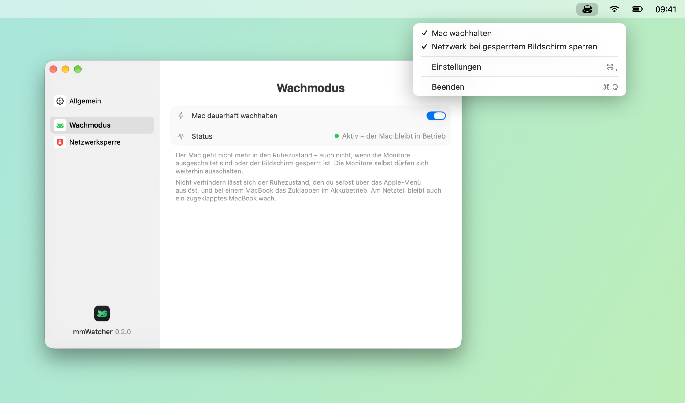
</picture>

## Funktionen

- **Wachmodus:** Der Mac geht nicht mehr in den Ruhezustand – auch nicht, wenn die Monitore ausgeschaltet sind oder der Bildschirm gesperrt ist. Die Monitore selbst dürfen sich weiterhin ausschalten.
- **Netzwerksperre:** Sobald der Bildschirm gesperrt wird, sperrt mmWatcher wahlweise die gesamte Netzwerkverbindung oder nur eingehende Verbindungen – Fernzugriff ist dann unmöglich. Beim Entsperren ist das Netzwerk sofort wieder offen.
- **Nur Menüleiste:** Ein Klick öffnet die Einstellungen, ein Rechtsklick schaltet Wachmodus und Netzwerksperre ein und aus. Das Symbol ist wählbar und lässt sich ausblenden.
- **Start bei der Anmeldung** und nach jedem Neustart.
- **Erscheinungsbild** wählbar: Automatisch (wie das System), Hell oder Dunkel.
- **Signiert und von Apple beglaubigt**, **automatische Updates** nach Bestätigung, **Deutsch, Englisch, Französisch, Italienisch und Spanisch**, Liquid Glass ab macOS 26.

<picture>
  <source media="(prefers-color-scheme: dark)" srcset="images/de/menubar-dark.png">
  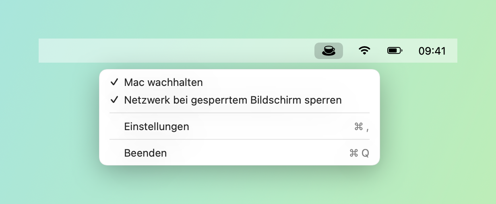
</picture>

## Einstellungen

  <picture>
    <source media="(prefers-color-scheme: dark)" srcset="images/de/settings-general-dark.png">
    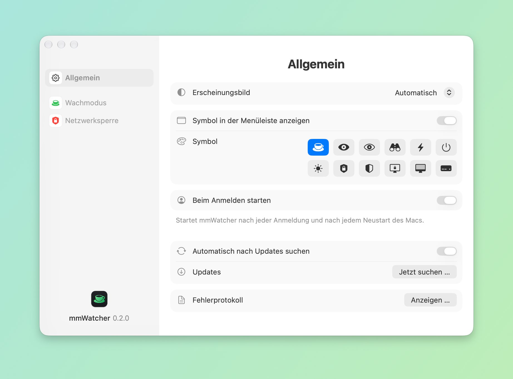
  </picture>
  <picture>
    <source media="(prefers-color-scheme: dark)" srcset="images/de/settings-awake-dark.png">
    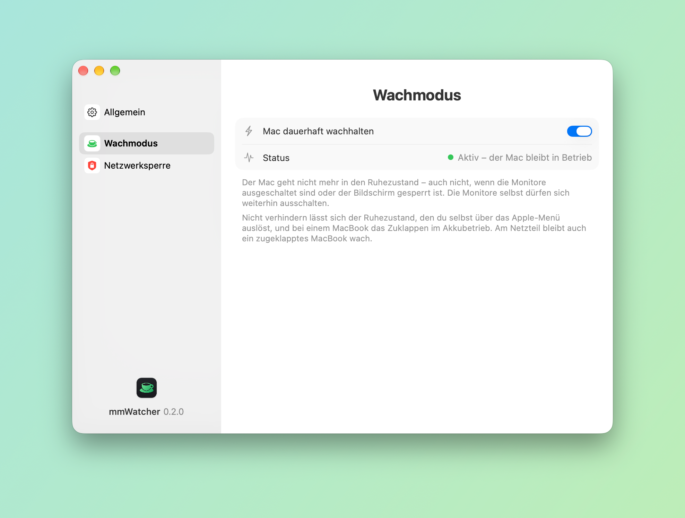
  </picture>

  <picture>
    <source media="(prefers-color-scheme: dark)" srcset="images/de/settings-network-dark.png">
    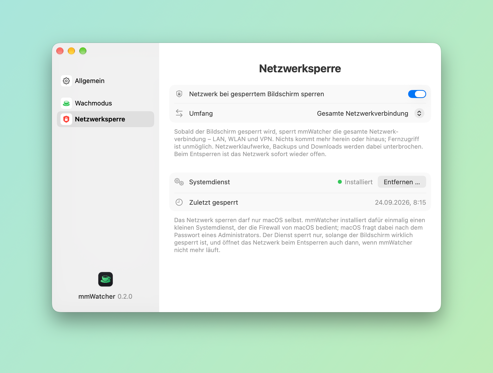
  </picture>
  <picture>
    <source media="(prefers-color-scheme: dark)" srcset="images/de/about-dark.png">
    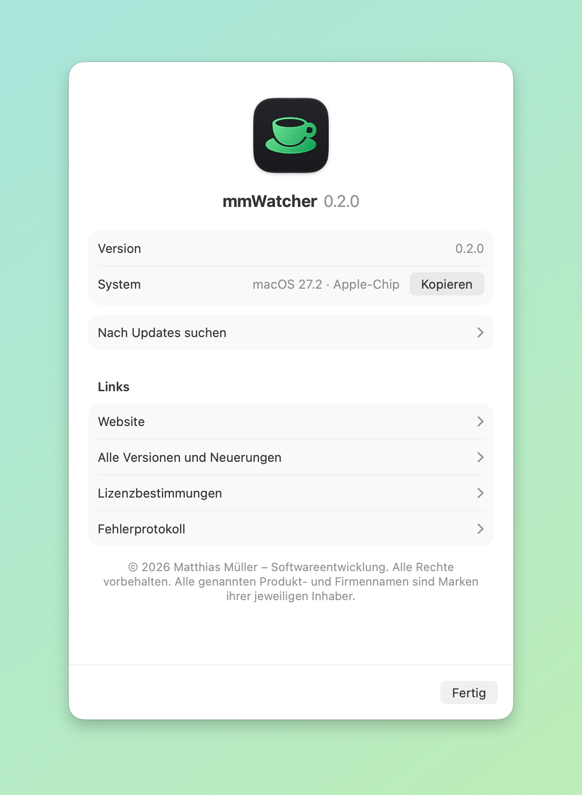
  </picture>

## Download und Installation

1. Unter [Releases](../../releases/latest) die Datei `mmWatcher-<Version>.dmg` herunterladen.
2. DMG öffnen und mmWatcher in den Ordner „Programme“ ziehen.
3. mmWatcher per Doppelklick öffnen – die App ist mit einem Apple-Entwicklerzertifikat signiert und von Apple beglaubigt (notarisiert), es erscheint keine Sicherheitsabfrage.

Danach aktualisiert sich mmWatcher selbst: Die App sucht täglich nach neuen Versionen und installiert sie nach Bestätigung (Einstellungen › Allgemein › „Jetzt suchen …“).

## So arbeitet die Netzwerksperre

Das Netzwerk sperren darf nur macOS selbst. mmWatcher installiert dafür einmalig einen kleinen Systemdienst, der die Firewall von macOS bedient; macOS fragt dabei nach dem Passwort eines Administrators.

- **Gesamte Netzwerkverbindung:** Nichts kommt mehr herein oder hinaus – LAN, WLAN und VPN. Netzwerklaufwerke, Backups und Downloads werden unterbrochen, solange der Bildschirm gesperrt ist.
- **Nur eingehende Verbindungen:** Der Mac nimmt nichts mehr von aussen an, laufende Fernzugriffe (Bildschirmfreigabe, SSH, Dateifreigabe) werden gekappt. Was der Mac selbst aufgebaut hat, läuft weiter.
- Der Dienst sperrt nur, solange der Bildschirm wirklich gesperrt ist, und öffnet das Netzwerk beim Entsperren auch dann, wenn mmWatcher nicht mehr läuft. Entfernen lässt er sich jederzeit in den Einstellungen.

## Voraussetzungen

- macOS 14 (Sonoma) oder neuer, Mac mit Apple-Chip oder Intel
- Nicht verhindern lässt sich der Ruhezustand, den du selbst über das Apple-Menü auslöst, und das Zuklappen eines MacBooks im Akkubetrieb.

---

## English

<picture>
  <source media="(prefers-color-scheme: dark)" srcset="images/en/hero-dark.png">
  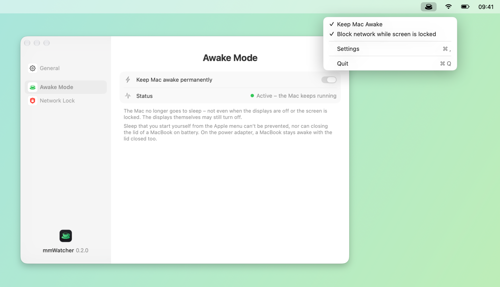
</picture>

mmWatcher keeps your Mac awake permanently – and, if you like, blocks the network while the screen is locked.

- **Awake mode:** the Mac no longer goes to sleep – not even when the displays are off or the screen is locked. The displays themselves may still turn off.
- **Network lock:** as soon as the screen is locked, mmWatcher blocks either the entire network connection or incoming connections only – remote access becomes impossible. When you unlock the screen, the network is open again right away.
- **Menu bar only:** a click opens the settings, a right-click switches awake mode and network lock on and off. Choose the icon or hide it.
- **Launch at login** and after every restart.
- **Appearance** of your choice: Automatic (like the system), Light or Dark.
- **Signed and notarized by Apple**, **automatic updates** once you confirm, **English, German, French, Italian and Spanish**, Liquid Glass on macOS 26 and later.

  <picture>
    <source media="(prefers-color-scheme: dark)" srcset="images/en/settings-general-dark.png">
    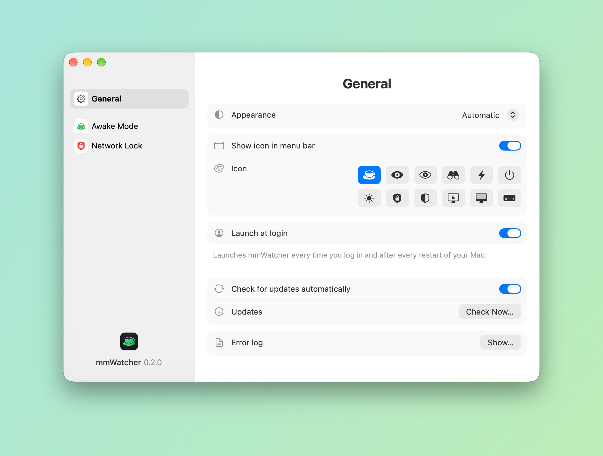
  </picture>
  <picture>
    <source media="(prefers-color-scheme: dark)" srcset="images/en/settings-awake-dark.png">
    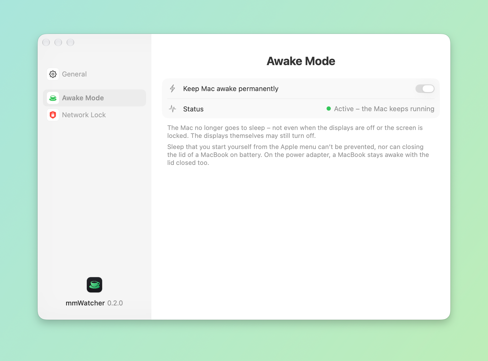
  </picture>

  <picture>
    <source media="(prefers-color-scheme: dark)" srcset="images/en/settings-network-dark.png">
    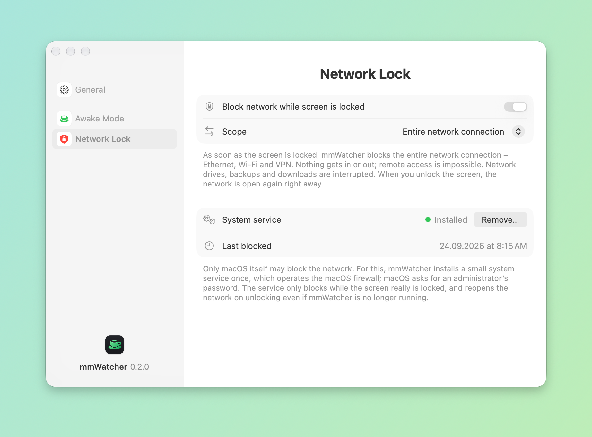
  </picture>
  <picture>
    <source media="(prefers-color-scheme: dark)" srcset="images/en/about-dark.png">
    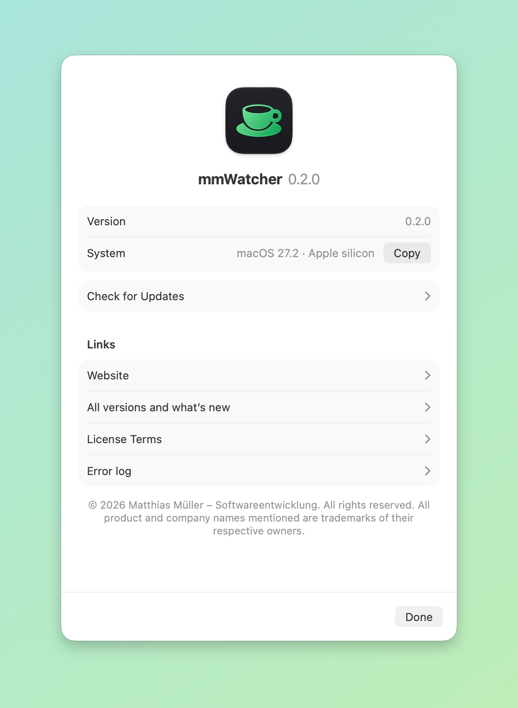
  </picture>

### Download and installation

1. Download `mmWatcher-<version>.dmg` from [Releases](../../releases/latest).
2. Open the disk image and drag mmWatcher to the Applications folder.
3. Double-click mmWatcher – the app is signed with an Apple developer certificate and notarized by Apple, so macOS opens it without any warning.

After that mmWatcher updates itself: it checks for new versions daily and installs them once you confirm (Settings › General › “Check Now…”).

### How the network lock works

Only macOS itself may block the network. For this, mmWatcher installs a small system service once, which operates the macOS firewall; macOS asks for an administrator’s password.

- **Entire network connection:** nothing gets in or out – Ethernet, Wi-Fi and VPN. Network drives, backups and downloads are interrupted while the screen is locked.
- **Incoming connections only:** the Mac accepts nothing from outside, and remote sessions in progress (screen sharing, SSH, file sharing) are cut. Whatever the Mac opened itself keeps running.
- The service only blocks while the screen really is locked, and reopens the network on unlocking even if mmWatcher is no longer running. You can remove it in the settings at any time.

### Requirements

- macOS 14 (Sonoma) or later, Mac with Apple silicon or Intel
- Sleep that you start yourself from the Apple menu can’t be prevented, nor can closing the lid of a MacBook on battery.

---

© 2026 Matthias Müller – Softwareentwicklung · Alle Rechte vorbehalten / All rights reserved · [Lizenzbestimmungen / License terms](LICENSE.md) · [www.mm-softwareentwicklung.de](https://www.mm-softwareentwicklung.de)

Alle genannten Produkt- und Firmennamen sind Marken ihrer jeweiligen Inhaber. 
All product and company names mentioned are trademarks of their respective owners.
